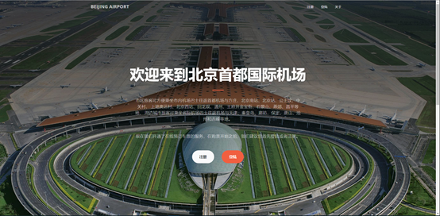
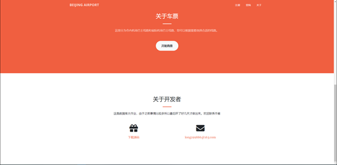

# bus_booking_system

这是数据库原理课程的大作业

### 开发环境：

​	python3.6.3 + Django2.1.1

### 实现的功能：

​	**所有用户：** 注册，登录

​	**用户：** 选车，选座位

​	**司机：** 检票

​	**公司雇员：** 查看用户信息

#### 放个首页的图片：

也就首页能看了（其实是套了模板），剩下的页面没怎么美化就不放首页了2333。

肝了两天多，为了交作业还是简化了一些功能，如果有时间的话可以继续加一些功能和做一下美化的。~~（当然大概率没有了）~~

**假期快乐！**

